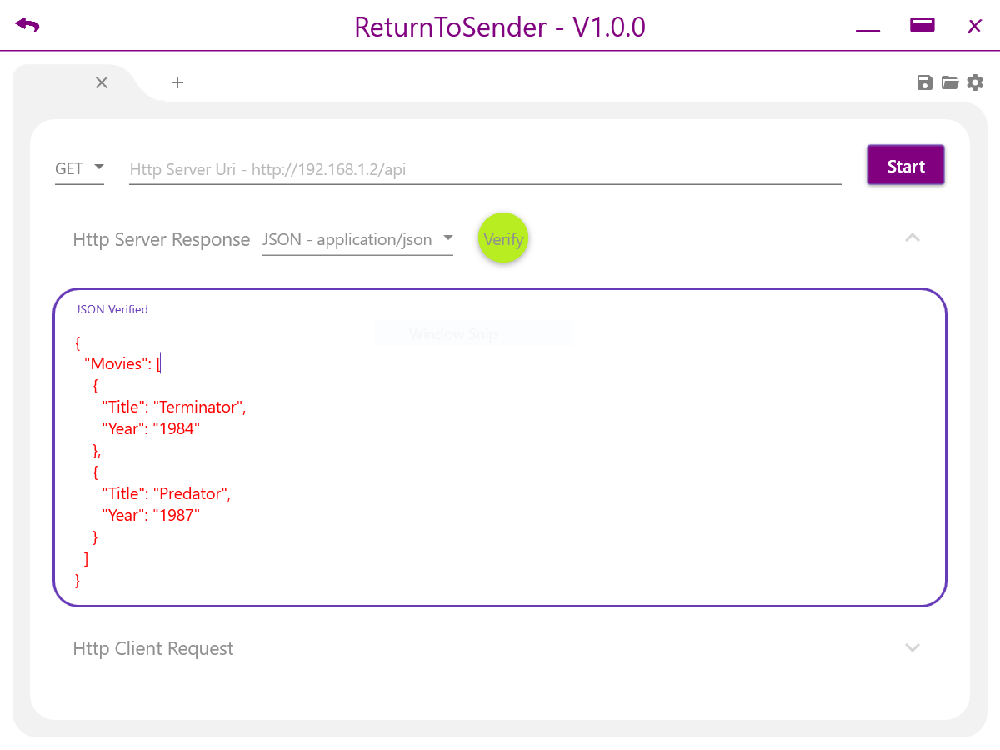

# ReturnToSender

# Summary
Mock Http Server to speed up Http client based software development. This application runs the HTTP server locally on your PC, unlike others
that are web hosted. This is ideal for avoiding annoying workplace IT proxy's or if you are just testing on your laptop and don't have internet access.
# Getting Started
There are two ways you can get the application.
* Download the application from the release section, unzip and run the ReturnToSender.exe
* Download the Visual Studio projec source code and build it yourself.

Once you have the application started if you are only listening for HTTP request on your laptop then you are done, if you would like the server
to respond to HTTP request from anywhere on your network you will need to allow you laptop to pass HTTP requests. The easiest way to do this
is to enable IIS on your laptop. You may need to adjust your firewall settings, you can do this by adding inbound rules for the application to your firewall.

Enter the Url you want the server to listen for and set the request type. Then enter the response you would like the server to reply with
and select the response type. Press start and make a HTTP request from your client, the server will respond with the content you entered and
the server will display the clients request information including the body.

# Versions
## V1.0.0 Supports
* HTTP Content Syntax Verification
    * JSON - supported
    * Text - supported
    * JavaScript - not supported
    * XML - supported
    * HTML - supported
* HTTP Request types
    * GET
    * POST
    * PUT
    * PATCH
    * DELETE
* Features
    * Upto ten HTTP servers
    * Saving and opening server configurations
    * Alternative themes, including dark.